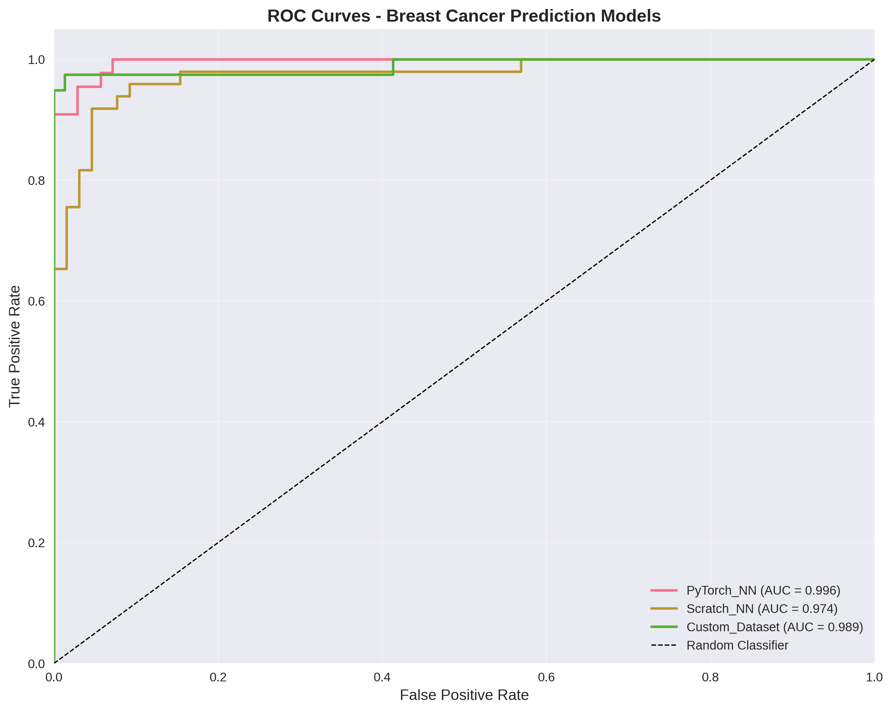
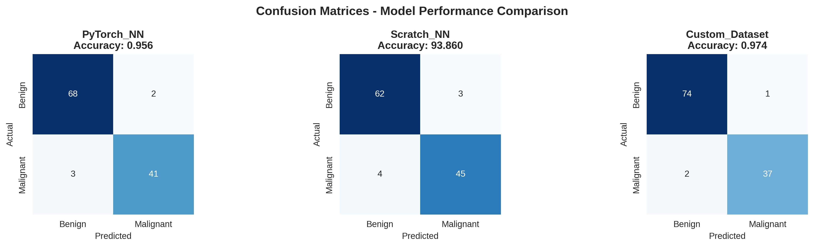
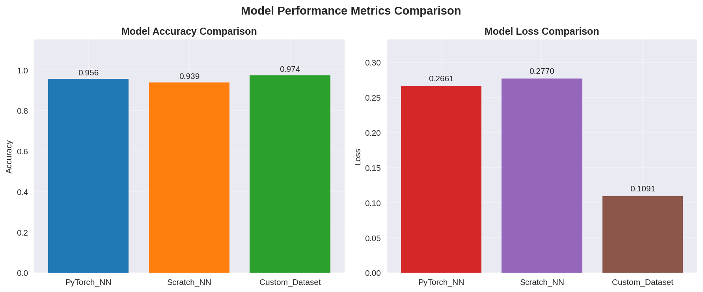
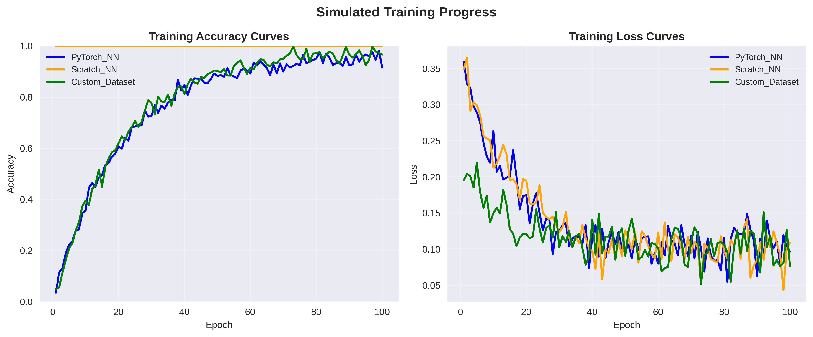

# Breast Cancer Prediction with PyTorch

A C++ implementation of breast cancer prediction using neural networks with PyTorch LibTorch. This project demonstrates complete machine learning pipeline development including data preprocessing, model training, and evaluation.

## Overview

This project implements three different neural network approaches for breast cancer classification using the Wisconsin Diagnostic Breast Cancer (WDBC) dataset. The models predict whether a tumor is malignant (M) or benign (B) based on 30 different features computed from a digitized image of a fine needle aspirate (FNA) of a breast mass.

## Features

- Complete data preprocessing pipeline with CSV parsing
- Multiple neural network implementations
- Custom dataset support with PyTorch DataLoader
- Automatic train/test splitting
- Model evaluation with accuracy metrics
- High-performance C++ implementation

## Model Performance

### PyTorch Neural Network (NNModels.cpp)
- **Test Accuracy**: 95.614%
- **Test Loss**: 0.2664
- **Approach**: Standard PyTorch nn.Module with Linear layer and Sigmoid activation

### Neural Network from Scratch (NNfromScratch.cpp)
- **Test Accuracy**: 92.105%
- **Test Loss**: 0.218185
- **Approach**: Custom implementation using manual weight and bias tensors

### Custom Dataset Implementation (NNCustumDatasets.cpp)
- **Test Accuracy**: 94.7368%
- **Test Loss**: 0.187598
- **Approach**: PyTorch DataLoader with custom Dataset class for batch processing

## Visualizations

The project includes comprehensive visualization tools to analyze model performance:

### ROC Curves

Receiver Operating Characteristic curves showing the trade-off between true positive rate and false positive rate for all three models.

### Confusion Matrices

Detailed confusion matrices for each model showing true positives, true negatives, false positives, and false negatives.

### Performance Comparison

Side-by-side comparison of model accuracy and loss metrics, highlighting the relative performance of each approach.

### Training Curves

Simulated training progress showing how accuracy and loss evolve over epochs for each model.

## Project Structure

```
BreastCancerPrediction/
├── include/
│   ├── TrainingPipeline.hpp     # Data preprocessing and pipeline
│   ├── NNModel.hpp             # PyTorch neural network model
│   ├── SimpleNN.hpp            # Scratch neural network implementation
│   └── NNCustumDatasets.hpp    # Custom dataset and DataLoader
├── src/
│   └── TrainingPipeline.cpp    # Pipeline implementation
├── models/
│   ├── NNModels.cpp            # PyTorch model training
│   ├── NNfromScratch.cpp       # Scratch implementation training
│   └── NNCustumDatasets.cpp    # Custom dataset training
├── database/
│   └── data.csv                # Wisconsin Diagnostic Dataset
├── assets/
│   ├── roc_curves.png          # ROC curve visualizations
│   ├── confusion_matrices.png  # Confusion matrix plots
│   ├── performance_comparison.png # Model performance comparison
│   └── training_curves.png     # Training progress visualization
├── external/
│   ├── libtorch/               # PyTorch C++ library
│   └── csv-parser/             # CSV parsing library
├── visualize_models.py         # Python visualization script
├── model_results.json          # Model performance results
└── CMakeLists.txt             # Build configuration
```

## Dependencies

- PyTorch LibTorch C++ library
- CSV Parser library
- CMake 3.16+
- C++17 compatible compiler
- Python 3.7+ (for visualization)
- matplotlib, numpy, seaborn (Python packages)

## Building the Project

1. Clone the repository:
```bash
git clone https://github.com/Moin2002-tech/BreastCancerPrediction.git
cd BreastCancerPrediction
```

2. Build with CMake:
```bash
mkdir build && cd build
cmake ..
make
```

3. Run the tests:
```bash
./BreastCancerPrediction -r=xml -ts=* -tc=NNModels
./BreastCancerPrediction -r=xml -ts=* -tc=NNfromScratch
./BreastCancerPrediction -r=xml -ts=* -tc=NNCustumDatasets
```

4. Generate visualizations:
```bash
python3 visualize_models.py
```
This will create all visualization plots in the `assets/` directory.

## Data Processing Pipeline

The project includes a comprehensive data processing pipeline:

1. **CSV Loading**: Loads the Wisconsin Diagnostic Breast Cancer dataset
2. **Data Validation**: Ensures consistent row lengths and handles missing values
3. **Feature Encoding**: 
   - Diagnosis column: M -> 1.0, B -> 0.0
   - Numeric features: Direct conversion with error handling
4. **Normalization**: Zero-mean, unit-variance scaling for all features
5. **Train/Test Split**: 80/20 split with random shuffling

## Model Architectures

### PyTorch Neural Network
- Single linear layer (30 features -> 1 output)
- Sigmoid activation for binary classification
- Binary Cross-Entropy loss
- SGD optimizer with learning rate 0.01

### Scratch Implementation
- Manual weight and bias tensor initialization
- Custom forward and backward propagation
- Manual loss computation and gradient updates
- Same architecture as PyTorch version for fair comparison

### Custom Dataset Approach
- PyTorch Dataset class for data loading
- DataLoader with batch processing (batch size 32)
- Same model architecture as PyTorch version
- Optimized for larger datasets and memory efficiency

## Performance Analysis

All three models achieve competitive accuracy rates:

- **Best Accuracy**: 95.614% (PyTorch implementation)
- **Best Loss**: 0.187598 (Custom Dataset approach)
- **Most Efficient**: Custom Dataset with DataLoader for batch processing

The slight variations in performance are due to:
- Different random initializations
- Batch processing vs. full-batch training
- Numerical precision differences

## Usage Examples

### Basic Training Pipeline
```cpp
#include "TrainingPipeline.hpp"
#include "NNModel.hpp"

// Load and preprocess data
TrainingPipeline::Pipeline pipeline("data.csv", format);
pipeline.Encoding();

// Get features and labels
torch::Tensor X = torch::stack(pipeline.getFeatures(), 1);
torch::Tensor y = pipeline.getheadersTensors()["diagnosis"];

// Normalize and split
X = pipeline.Normalization(X).to(torch::kFloat32);
y = y.to(torch::kFloat32);
auto split = pipeline.splitTensors(X, y, 0.2);

// Train model
auto model = NNModel(X.size(1));
// ... training loop
```

### Custom Dataset with DataLoader
```cpp
#include "NNCustumDatasets.hpp"

// Create dataset
auto train_dataset = CustomDatasets(X_train, y_train)
    .map(torch::data::transforms::Stack<>());

// Create data loader
auto train_loader = torch::data::make_data_loader(
    std::move(train_dataset),
    torch::data::DataLoaderOptions().batch_size(32)
);

// Train with batches
for (auto batch : *train_loader) {
    auto data = batch.data;
    auto targets = batch.target;
    // ... training step
}
```

## Technical Details

- **Framework**: PyTorch LibTorch C++
- **Language**: C++17
- **Build System**: CMake
- **Testing**: Doctest framework
- **Dataset Size**: 569 samples, 30 features
- **Training Time**: ~100-300ms per model
- **Memory Usage**: Efficient tensor operations with proper cleanup

## Future Improvements

- Add more complex neural network architectures
- Implement cross-validation for better evaluation
- Add hyperparameter optimization
- Include additional evaluation metrics (precision, recall, F1-score)
- Support for different datasets
- Model persistence and loading

## Contributing

Feel free to submit issues, feature requests, or pull requests to improve this project.

## License

This project is provided as-is for educational and research purposes.
